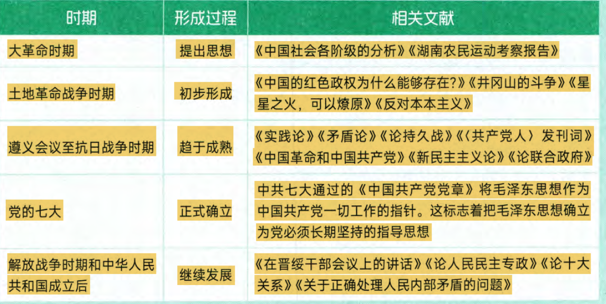
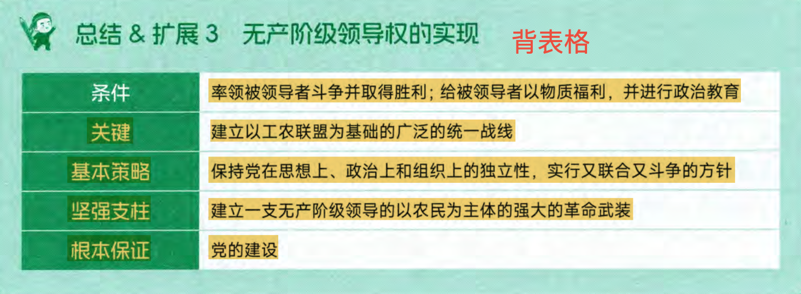

考点1:
1. 马克思主义中国化时代化是什么，内涵？
- 运用马克思主义观点立场方法，观察时代把握时，解决中国革命建设改革中的实际问题
- 总结和提炼中国革命，将改革的实践经验上升为理论，不断丰富发展马克思主义，赋予马克思主义新的时代内涵
- 植根于中华优秀传统文化，具有中国特色中国风格中国气派
1938年（全面抗战时期）毛泽东，《论新阶段》报告，标志马克思主义中国化命题正式提出（并非开始中国化）

1945 党的七大，刘少奇《关于修改党章的报告》，指出毛泽东思想是中国化的马克思主义，实现了马克思主义中国化时代化的第一次历史性飞跃

2. 为什么要推进马克思主义中国化
- 是马克思主义理论发展的内在要求
- 是解决中国实际问题的客观需要

3. 如何推进马克思主义中国化
- 同中国具体实际相结合，同中华优秀传统文化相结合

考点2:马克思主义中国化时代化的历史进程和理论成果

毛和中特的相同点：都以马克思主义为理论基础，都以实事求是为精髓，前者实践基础是革命与战争，后者是改革与建设

考点三：毛泽东思想形成和发展的历史条件
- 时代主题：19世纪末20世纪初，世界进入帝国主义和无产阶级革命时代
- 实践基础：中国共产党人进行革命和建设的成功实践

考点四：毛思想形成和发展过程

考点六：毛泽东思想活的灵魂
1981 十一届六中全会 《建国以来若干历史问题的决议》
- 实事求是：党根本思想路线
- 群众路线：党根本工作路线
- 独立自主： 党根本政治路线

十一届六中全会：
- 提出了毛泽东思想活的灵魂
- 科学评价了毛泽东思想和毛泽东本人
- 完成了拨乱反正
- 第一次使用了社会主义初级阶段

考点七：毛泽东思想的重要意义
- 马克思主义中国化时代化的第一个重大理论成果
- 中国革命和建设的科学指南，中国共产党和中国人民宝贵的精神财富

考点八：近代中国国情和中国革命的时代特征
- 国情：半殖民地半封建社会（经济政治发展极不平衡
- 主要矛盾：帝国主义和中华民族的矛盾，封建主义和人民大众的矛盾，帝国主义和中华民族的矛盾是最主要的矛盾
- 根本任务：推翻帝国主义，封建主义和官僚资本主义
- 革命阶级民主革命：资产阶级革命
新旧的区别：前者资产阶级领导（三民主义）后者无产阶级（马克思主义）

考点九：新民主主义革命理论的实践基础
- 基于旧民主主义革命没有为中华民族找到出路
- 新民主主义革命实践需要，对中国革命经验教训的概括和总结

考点十：新民主主义革命的总路线

总路线内容：无产阶级领导的，人民大众的，反对帝国主义，封建主义，官僚资本主义的革命（革命领导者，革命动力，革命对象）

1. 革命对象
- 分清敌友：革命的首要问题
 - 帝国主义：中国革命的首要对象，是中国社会进步和发展的最大障碍，诗近代中国贫困落后和一切灾难祸害的总根源
 - 封建主义：封建地主阶级诗帝国主义统治中国和封建军阀实行专职统治的社会基础，是没有**丝毫**进步作用的阶级，是中国经济现代化和政治民主化的主要的，直接的障碍
 - 官僚资本主义：对广大劳动人民残酷剥削和对民族工商业巧取豪夺，严重舒服了中国社会生产力的发展，因此也是革命的对象

2. 新民主主义革命的动力：包括无产阶级，农民阶级，城市小资产阶级和民族资产阶级
- 无产阶级：中国革命最基本的动力，诗新的社会生产力的代表，是近代中国最进步的阶级，是中国革命的领导力量
- 农民阶级：农民问题是中国革命的基本问题，中国革命战争实质上就是党领导下的农民战争
- 城市小资产阶级：无产阶级可靠的同盟者
- **民族资产阶级**：中国革命的动力之一，
 - 两面性
  1. 受帝国主义封建主义的压迫，是革命的力量之一
  2. 在经济和政治上与帝国主义和封建主义有千丝万缕的联系，没有彻底反帝反封建的勇，因而在革命的关键时刻表现出明显的动摇性，因此既不可能充当革命的主要力量，更不可能是革命的领导力量。
**在经济上保护民族工商业，政治上争取，对其动摇性和妥协性进行批评和斗争，又斗争又联合，这是合乎实际的，争取革命胜利的要求**

3. 新民主主义个革命的领导力量
- 无产阶级领导权的重要性：**无产阶级领导权是中国革命的中心问题**，也是新民主主义理论的核心问题。区分新旧两种不同民主革命的根本标志是，领导权是在无产阶级还是资产阶级。无产阶级及其政党的领导，是中国革命取得胜利的根本保证。
- 无产阶级特点和优点：
 1. 共性：与先进的生产方式相联系，没有私人占有的生产资料，富于组织纪律性
 2. 个性：中国无产阶级在革命斗争中比任何阶级都更坚决更彻底，分布集中，有利于无产阶级队伍的组织和团结，有利于革命思想的传播和强大革命力量的形成，与农民有天然的联系，便于和农民结成亲密的同盟，共同团结战斗。
- 无产阶级领导权的实现：无产阶级及其政党对中国革命的领导权不是自然而然得来的，而是在与资产阶级争夺领导权的斗争中实现的。

 1. 率领被领导者(同盟者)向着共同敌人作坚决的斗争，并取得胜利
 2. 对被领导者给以物质福利，至少不损害其利益，同时对被领导者给以政治教育

4. 新民主主义革命的性质和前途
近代中国半殖民地半封建社会的性质和中国革命的历史任务，决定了新民主主义革命的性质不是无产阶级社会主义革命，而是资产阶级民主主义革命。

- 两步走：民主主义革命是社会主义革命的必要准备，社会主义革命是民主主义革命的必然趋势
- 左倾一次革命论错误：只看到了民主革命和社会主义革命的联系，混淆了民主革命和社会主义革命的区别
- 右倾二次革命论错误：只看到了民主革命和社会主义革命的区别，没有看到联系

考点11:新民主主义革命基本纲领
1940，毛泽东《新民主主义论》：阐述了新民主主义的政治经济文化
1945，党的七大：论联合政府：**具体**阐述了新民主主义政治经济文化

- 政治纲领：**推翻帝国主义和封建主义的统治，建立一个无产阶级领导的，以工农联盟为基础的，各革命阶级联合专政的新民主主义的共和国**
 - 国体：各革命阶级联合专政
 - 政体：民主集中制的人民代表大会制度（人民民主专政）

- 经济纲领：
 1. 没收封建地主阶级的土地归农民所有，是新民主主义革命的主要内容
 2. 没收官僚资本归新民主主义国家所有，是应有之义（包含新民主主义革命和社会主义革命的双重性质）
 3. 保护民族工商业，诗新民主主义经济纲领中极具特色的一项内容

- 文化纲领：民族的科学的大众的文化，居于指导地位的是共产主义思想
 - 新民主主义文化是民族的：就其内容说是反对帝国主义压迫，主张中华民族的尊严和独立；
就其形式说是具有鲜明的民族风格、民族形式和民族特色，要有中国作风和中国气派。

 - 新民主主义文化是科学的：反对一切封建思想和迷信思想，主张实事求是、客观真理及理
论和实践的一致性。对于封建时代创造的文化，应剔除其封建性的糟粕，吸收其民主性的精华。同时要尊重中国的历史，反对民族虚无主义，以历史唯物主义的态度对待古今中外文化，发展
民族新文化，提高民族自信心。

 - 新民主主义文化是大众的：也就是民主的文化。文化工作者要用革命文化教育和武装人民
大众，使它成为人民大众的有力思想武器；同时又要以人民群众的实践作为创作的源泉，坚持
为人民大众服务的方向。

考点12:新民主主义革命道路